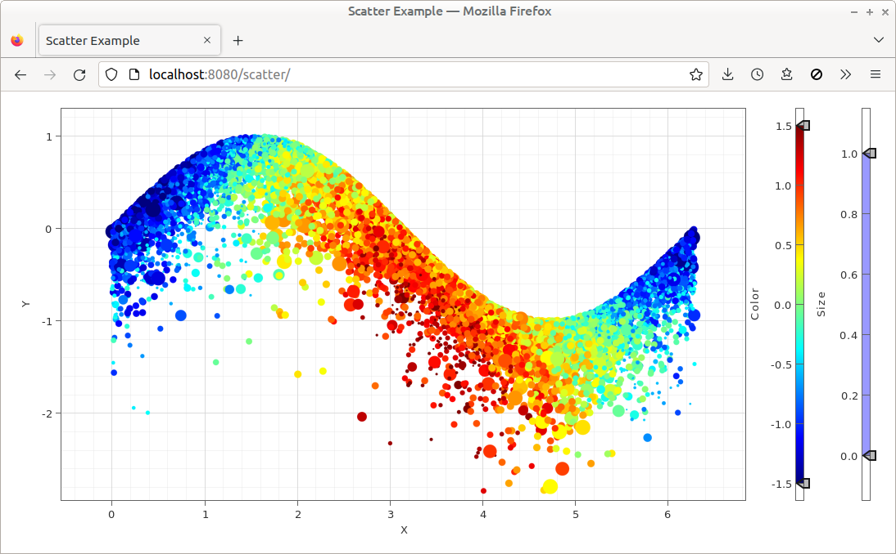
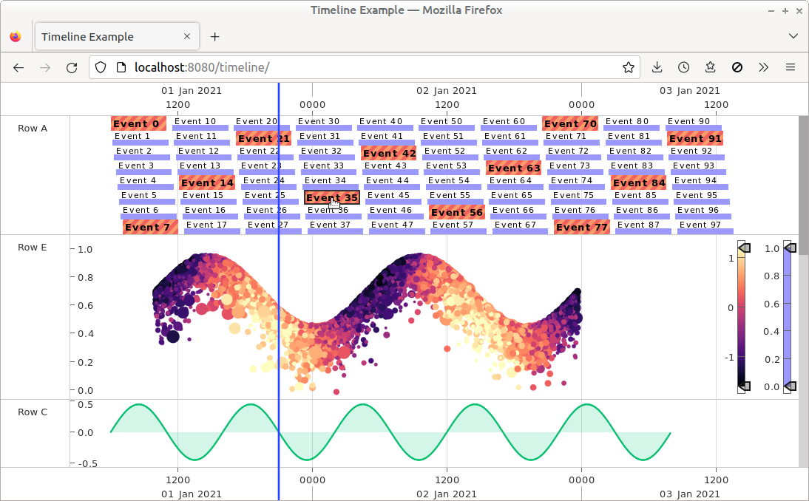
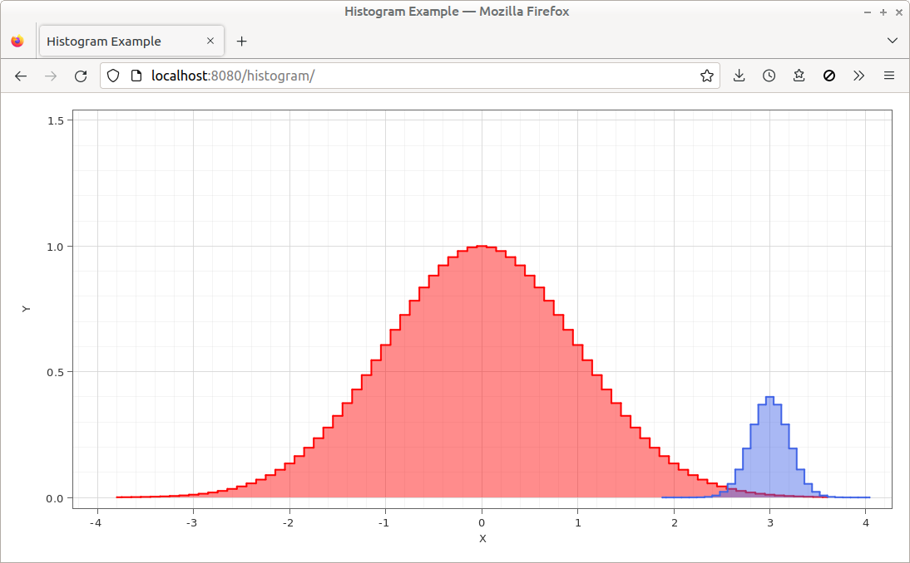
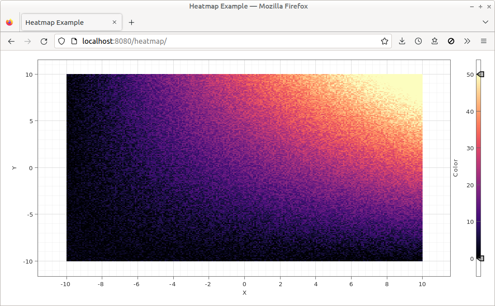
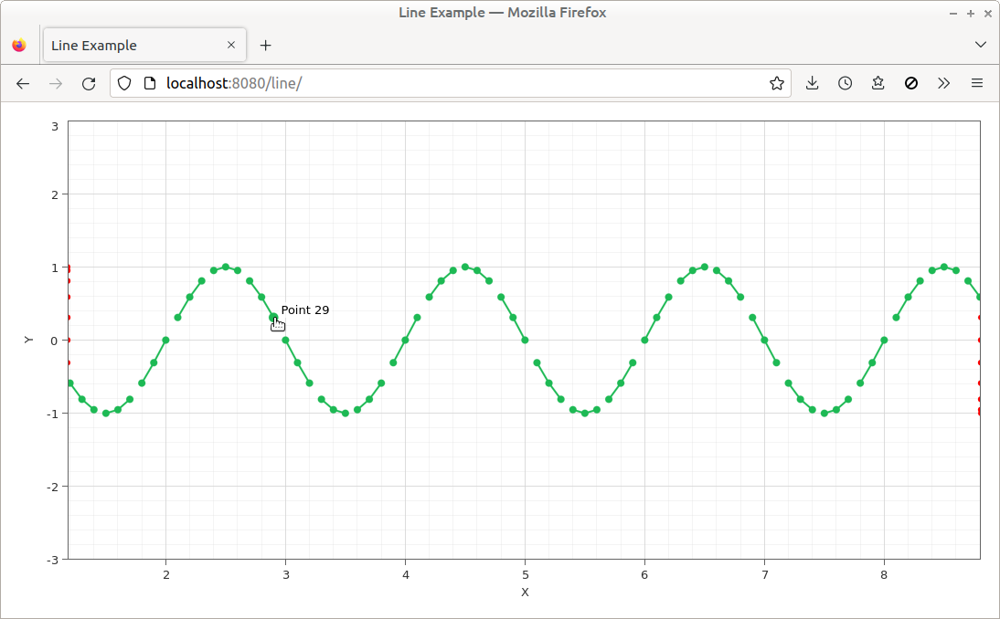
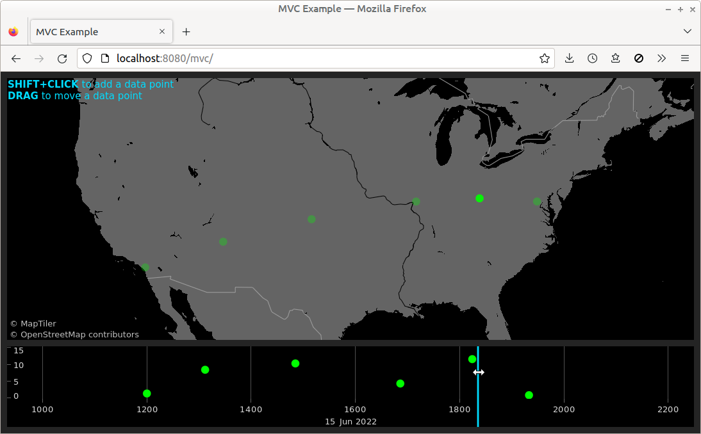
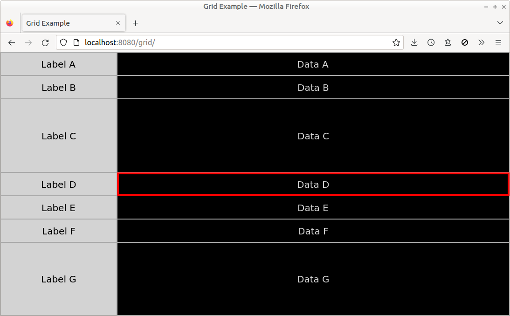
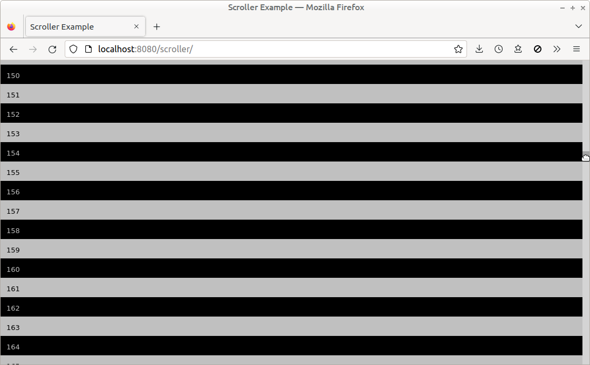

# Gleam

Gleam is a library for building interactive visualizations of multi-dimensional data, built on [WebGL](https://www.khronos.org/webgl/).

If you're new to Gleam, start by looking through the [examples](#examples).

For notes about working on the Gleam code, see the [dev guide](./DEVELOPERS.md).

To get an overview of Gleam's core concepts, see the [docs](./docs/).

The [code](./examples/) of the examples shows how to use the Gleam API.

## Examples
<!--
 To make all columns the same width, the longest line of text in each cell is identical to the longest line of text in every other cell
-->
<table>
<tr>
<td><b>Scatter Plot</b>  <a href="./examples/scatter/">Code</a>&nbsp;&nbsp;|&nbsp;&nbsp;<a href="https://metsci.github.io/gleam/examples/scatter/">Demo</a>&nbsp;&nbsp;&nbsp;</td>
<td><b>Timeline</b>  <a href="./examples/timeline/">Code</a>&nbsp;&nbsp;|&nbsp;&nbsp;<a href="https://metsci.github.io/gleam/examples/timeline/">Demo</a>&nbsp;&nbsp;&nbsp;</td>
<td><b>GeoJSON</b>  <a href="./examples/geojson/">Code</a>&nbsp;&nbsp;|&nbsp;&nbsp;<a href="https://metsci.github.io/gleam/examples/geojson/">Demo</a>&nbsp;&nbsp;&nbsp;</td>
</tr>
<tr>
<td><b>Histogram</b>  <a href="./examples/histogram/">Code</a>&nbsp;&nbsp;|&nbsp;&nbsp;<a href="https://metsci.github.io/gleam/examples/histogram/">Demo</a>&nbsp;&nbsp;&nbsp;</td>
<td><b>Heatmap</b>  <a href="./examples/heatmap/">Code</a>&nbsp;&nbsp;|&nbsp;&nbsp;<a href="https://metsci.github.io/gleam/examples/heatmap/">Demo</a>&nbsp;&nbsp;&nbsp;</td>
<td><b>Line Plot</b>  <a href="./examples/line/">Code</a>&nbsp;&nbsp;|&nbsp;&nbsp;<a href="https://metsci.github.io/gleam/examples/line/">Demo</a>&nbsp;&nbsp;&nbsp;</td>
</tr>
<tr>
<td><b>Model View Whatever</b>  <a href="./examples/mvc/">Code</a>&nbsp;&nbsp;|&nbsp;&nbsp;<a href="https://metsci.github.io/gleam/examples/mvc/">Demo</a>&nbsp;&nbsp;&nbsp;</td>
<td><b>MVT Tiles</b>  <a href="./examples/mvt/">Code</a>&nbsp;&nbsp;|&nbsp;&nbsp;<a href="https://metsci.github.io/gleam/examples/mvt/">Demo</a>&nbsp;&nbsp;&nbsp;</td>
<td><b>Grid Layout</b>  <a href="./examples/grid/">Code</a>&nbsp;&nbsp;|&nbsp;&nbsp;<a href="https://metsci.github.io/gleam/examples/grid/">Demo</a>&nbsp;&nbsp;&nbsp;</td>
</tr>
<tr>
<td><b>Scroller Layout</b>  <a href="./examples/scroller/">Code</a>&nbsp;&nbsp;|&nbsp;&nbsp;<a href="https://metsci.github.io/gleam/examples/scroller/">Demo</a>&nbsp;&nbsp;&nbsp;</td>
<td></td>
<td></td>
</tr>
</table>
