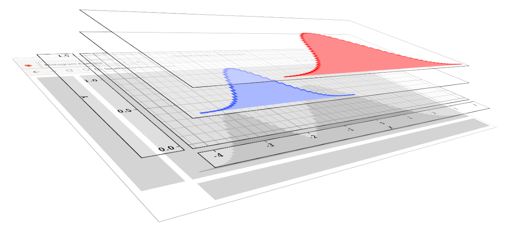

# Core Concepts

Gleam is designed around a handful of core concepts:
 - [Panes](#panes)
 - [Layouts](#layouts)
 - [Painters](#painters)
 - [Input handlers](#input-handlers)
 - [Input spectators](#input-spectators)
 - [Contraptions](#contraptions)

## Panes

A [**pane**](../packages/core/src/core/pane.ts#L207) is an object that represents a rectangular region of the canvas.

A pane can have a [layout](#layout), child panes, [painters](#painter), and [input handlers](#input-handler).

Within a parent pane, each child pane, painter, and input-handler has a **`zIndex`**. To render a pane, its child panes and painters are rendered from lowest `zIndex` to highest. (Tiebreaker is the order in which they were added to the pane -- children added earlier get rendered earlier.) When handling input, events are offered to a pane's child panes and input-handlers in the reverse of rendering order, so that children that appear visually on top also get the first opportunity to claim input events.

The `zIndex` ordering is capable of interleaving child panes with painters and input-handlers -- e.g. a child pane at `zIndex` `0` would be rendered before a painter at `zIndex` `999`, so the painter's content would appear *on top of the child pane*. In most cases you do want child panes on top of painters, but there are situations where it's helpful to have a painter on top -- e.g. `HorizontalTimeline` has a time-cursor painter and an input-handler for dragging the time-cursor, and their `zIndex` values make it feel like the time-cursor is on top of everything else in the timeline, including child panes.

## Layouts

A pane can contain **child panes**. Positions and sizes of child panes within their parent pane are determined by the parent pane's [**layout**](../packages/core/src/core/layout.ts).

Gleam has built-in general-purpose layouts [here](../packages/core/src/layouts/). Their params are set [via CSS](./styling.md).

Sometimes an ad-hoc layout impl is a clean and easy way to get layout behavior tailored for your specific use-case. The layout interface is easy to implement, e.g. by extending the [`LayoutBase`](../packages/core/src/core/layout.ts#L66) class.

## Painters

A pane can contain [**painters**](../packages/core/src/core/painter.ts). A painter uses [WebGL](https://webglfundamentals.org/) to render data or other content onto its pane's rectangular region.

Gleam has built-in general-purpose painters [here](../packages/core/src/painters/). Their styles are set [via CSS](./styling.md).

Writing custom painters for application-specific needs is encouraged! See the info [here](./gl-resources.md) on managing GL resources in painters. Custom painters are sometimes the best way to get rendering behavior that is tailored for your specific use-case. They take time to write -- especially if you aren't familiar with GL concepts like buffers, textures, and shaders -- but can provide compelling application-specific visualizations that aren't achievable with general-purpose painters.

## Input Handlers

A pane can have [**input-handlers**](../packages/core/src/core/pane.ts#L68) attached to it.

Each mouse event is first offered to the topmost pane that contains the event's location. If that pane has an input-handler that handles the event, the event is passed to that input-handler. Otherwise, the event is offered to the topmost pane's parent, then to its grandparent, and so on, until an input-handler is found. (To make a pane "opaque" to mouse events, set the `Pane.consumesInputEvents` field to `true`. This always prevents mouse events from propagating up to the pane's parent, regardless of whether the pane has a suitable input-handler.)

Each input-handler has a `target` field, which is a value that indicates the *thing being manipulated*. After an input-handler handles an event, [input-spectators](#input-spectators) are notified, and the handler's input-target is included in the notification, so that spectators can tell what was being manipulated.

Impls of [`HoverHandler`](../packages/core/src/core/pane.ts#L104) and [`DragHandler`](../packages/core/src/core/pane.ts#L119) may have associated mouse-cursor CSS classes. For example, a `DragHandler` that implements dragging an axis-tag up and down might be associated with CSS class `y-tag-dragger`, which is configured in [defaults.css](../packages/core/src/defaults.css#L254) to set the mouse cursor to `ns-resize` &nbsp;.

Keyboard events are passed to the input handlers of the **focused pane**, which is the most recent pane to have received a mouse-press event.

## Input Spectators

After an input-event is handled by an input-handler, [**input-spectators**](../packages/core/src/core/pane.ts#L157) are notified. The notification includes the handler's [input-target](#input-handlers), which indicates what was being manipulated.

Input-spectators differ from input-handlers in several ways:
 - Spectators run post-facto, after an input-event has been handled
 - Spectators have no effect on how input-events propagate among handlers
 - All spectators fire for all input-events received by any pane in the canvas

Consecutive hover events with the same input-target are considered a single continuous hover. (Input-targets are compared using [ImmutableJS equality](https://immutable-js.com/docs/v4.1.0/is()/).) Spectators' `hover`/`unhover` callbacks are called when such a sequence begins and ends. Similarly with `drag`/`undrag` and `focus`/`unfocus`.

For example, the handler that supports dragging a timeline-event bar has an input-target that holds (A) a reference to the dragged bar, and (B) a symbol indicating which part of the bar was being dragged: left edge, right edge, or center. When a spectator fires, it can e.g. highlight/unhighlight the bar on `hover`/`unhover`, or select the bar on `click`.

It's theoretically possible to add so many spectators that they bog down your application. This is not expected to happen in practice: spectators generally decide quickly whether to use or ignore an incoming event, the number of spectators that actually use any given event is small, and we only get a couple of input-events per frame.

## Contraptions

A contraption is any class that holds a purpose-specific assemblage of UI objects that are convenient to group together.

The term "contraption" emphasizes the ad-hoc nature of such classes, which need not conform to any particular interface, structure, or pattern. A contraption can have panes, layouts, painters, input-handlers, axes, DOM elements, and any other relevant objects. It can have whatever methods make sense for the purpose.

A couple of examples to illustrate how varied contraptions can be:

 - [`AxisWidget`](../packages/core/src/contraptions/axisWidget.ts) is a contraption that holds an axis, an axis painter, a pane, a purpose-specific layout, and input-handlers. The layout sets the pane's preferred size based on the painter's settings. The input-handlers allow zooming and panning the axis.

 - [`TooltipDiv`](../packages/core/src/contraptions/tooltip.ts) is a contraption with a DOM `div` element, and convenience methods for setting its text, position, and visibility.

Gleam has built-in general-purpose contraptions [here](../packages/core/src/contraptions/).
