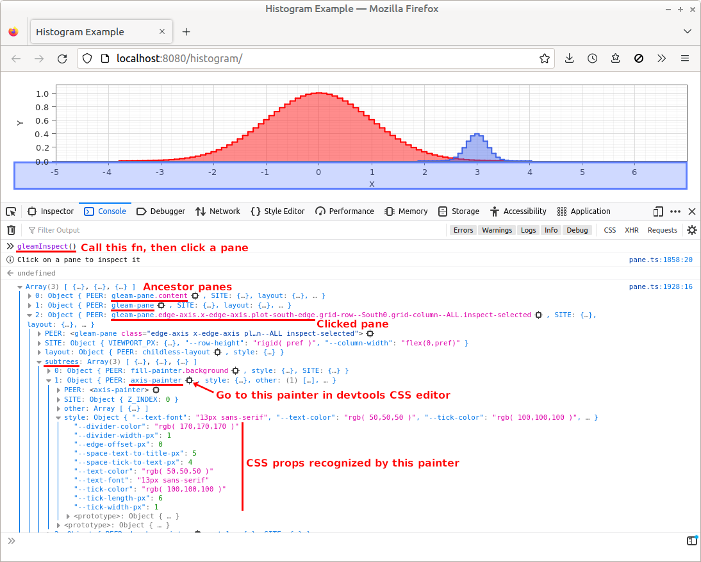
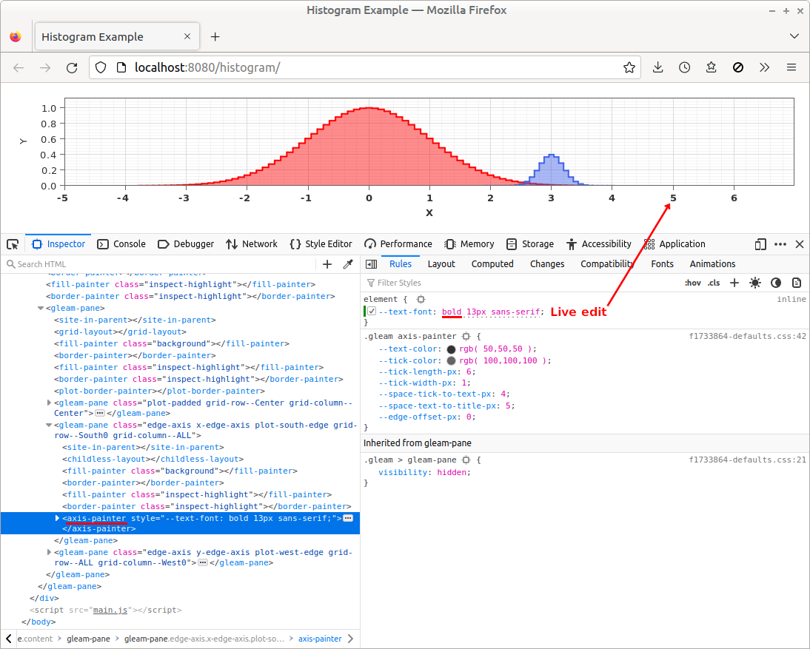

# Gleam Inspect

Gleam Inspect is Gleam's version of the browser's DOM Inspector. It provides a way to answer debugging questions like "why is my line black instead of red?" or "why is my text regular instead of bold?"

## Usage

To use Gleam Inspect:

 1. Run `gleamInspect()` in the devtools console

 1. Click on a Gleam pane in the application
    - Gleam will print a tree of info about the clicked pane

 1. Find the painter of interest in the printed info tree

 1. Go to the painter's peer in the browser's DOM inspector
    - In most browsers you can right-click the printed DOM-element text, then click `Reveal in Inspector` in the resulting popup menu
    - In some browsers you can click the &nbsp;&nbsp; icon next to the printed DOM-element text

 1. Edit the painter's CSS props in the browser's CSS editor

 1. Trigger a repaint
    - Gleam can detect *some* CSS live-edits, and will repaint automatically
    - When Gleam doesn't repaint automatically, trigger a repaint by e.g. clicking anywhere in the Gleam canvas

## Screenshots

Call `gleamInspect`; click on a pane; find the painter in the printed info tree:

Show the painter in the DOM Inspector; live-edit its CSS:

