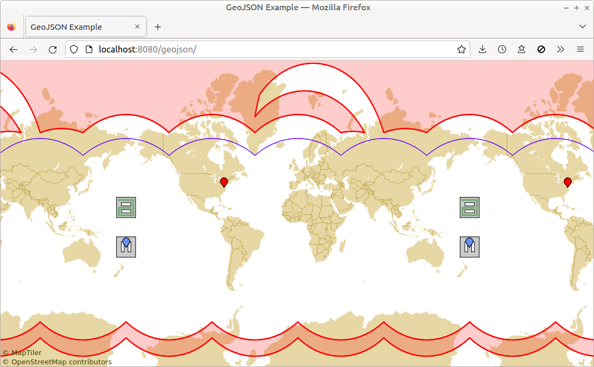

# GeoJSON Example

[Main](./src/main.ts) | [CSS](./src/main.css) | [Demo](https://metsci.github.io/gleam/examples/geojson/)

Shows how to use `GeoJsonPainter` to display GeoJSON data, with MVT geo tiles in the background.

**NOTE:** Env var `GLEAM_TILES_JSON_URL` must be set *at build time*, to e.g. `https://api.maptiler.com/tiles/v3/tiles.json?key=YOUR_API_KEY`. ... If you don't have access to an MVT server but want to build this example anyway, you can set `GLEAM_TILES_JSON_URL` to anything (e.g. the empty string). The build will succeed but the example will throw errors at runtime.

## Details

Has point, line, and polygon features that span the antimeridian.

Has a polygon feature covering the North Pole.

Has a line feature surrounding the North Pole.

Has a polygon surrounding the South Pole (i.e. has a hole that covers the pole).

Defaults to great-circle interp between data points. Specifies rhumb-line interp for several features.

Uses customized icons for point features.
