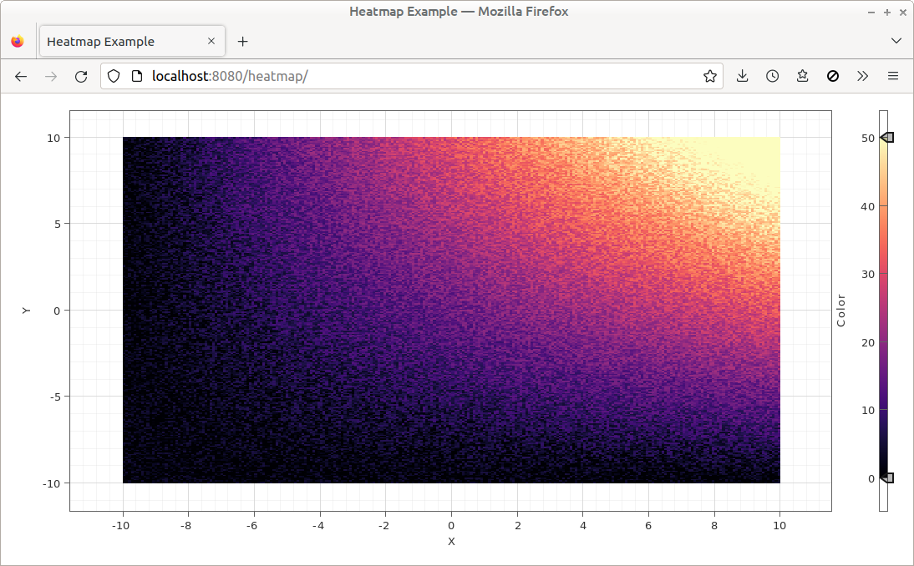

# Heatmap Example

Uses `HeatmapPainter` to display a heatmap.

Uses `Pane.enableColorTables()` to bundle additional color tables into the application. The color table used for display is selected in [main.css](./src/main.css).

