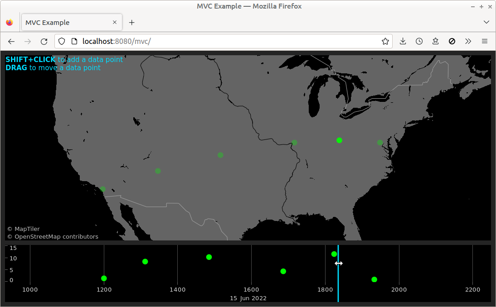

# MVC Example

Uses an imperative approach to create an MV* ([Model View Whatever](https://news.ycombinator.com/item?id=18518750)) application:
 - Uses `Ref` objects to hold application state in a data model
 - Creates views to display application state
 - Calls attach-controller fns to connect views to the model

**NOTE:** Env var `GLEAM_TILES_JSON_URL` must be set *at build time*, to e.g. `https://api.maptiler.com/tiles/v3/tiles.json?key=YOUR_API_KEY`. ... If you don't have access to an MVT server but want to build this example anyway, you can set `GLEAM_TILES_JSON_URL` to anything (e.g. the empty string). The build will succeed but the example will throw errors at runtime.

Interaction:
 - SHIFT+Click on the spatial plot to add a data point at a specific location
 - SHIFT+Click on the timeline to add a data point at a specific time
 - Drag data points to change their locations and/or times
 - Move the time cursor to highlight data points near the selected time

