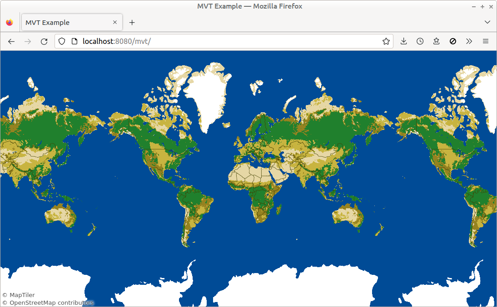

# MVT Tiles Example

Use `MvtPainter` to display [MVT geo tiles](https://github.com/mapbox/vector-tile-spec).

**NOTE:** Env var `GLEAM_TILES_JSON_URL` must be set *at build time*, to e.g. `https://api.maptiler.com/tiles/v3/tiles.json?key=MY_API_KEY`.

